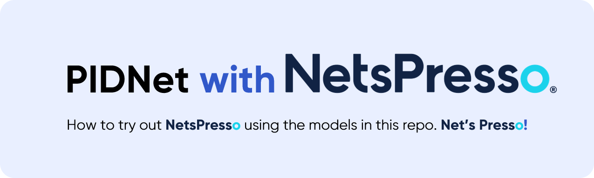

<div align="center">
  <p>
    <a align="center" href="README.netspresso.md" target="_blank">
      </a>
  </p>

</div>

# <div align="center">NetsPresso Tutorial for PIDNet Compressrion</div>
## Order of the tutorial
[1. Install](#1-install) </br>
[2. Prepare the dataset](#2-prepare-the-dataset) </br>
[3. Training](#3-training) </br>
[4. Convert PIDNet to _torchfx.pt](#4-convert-pidnet-to-_torchfxpt) </br>
[5. Model Compression with NetsPresso Python Package](#5-model-compression-with-netspresso-python-package)</br>
[6. Fine-tuning the compressed Model](#6-fine-tuning-the-compressed-model)</br>
[7. Evaluation](#7-evaluation)</br>
[8. Custom Inputs](#8-custom-inputs)</br>

## 1. Install
Clone repo, including
[**PyTorch==1.11**](https://pytorch.org/get-started/locally/).

```bash
git clone https://github.com/Nota-NetsPresso/PIDNet_nota  # clone
```
</br>

## 2. Prepare the dataset
* Download the [Cityscapes](https://www.cityscapes-dataset.com/) and [CamVid](http://mi.eng.cam.ac.uk/research/projects/VideoRec/CamVid/) datasets and unzip them in `data/cityscapes` and `data/camvid` dirs.
* Check if the paths contained in lists of `data/list` are correct for dataset images.

#### :smiley_cat: Instruction for preparation of CamVid data (remains discussion) :smiley_cat:

* Download the images and annotations from [Kaggle](https://www.kaggle.com/datasets/carlolepelaars/camvid), where the resolution of images is 960x720 (original);
* Unzip the data and put all the images and all the colored labels into `data/camvid/images/` and `data/camvid/labels`, respectively;
* Following the split of train, val and test sets used in [SegNet-Tutorial](https://github.com/alexgkendall/SegNet-Tutorial), we have generated the dataset lists in `data/list/camvid/`;
* Finished!!! (We have open an issue for everyone who's interested in CamVid to discuss where to download the data and if the split in [SegNet-Tutorial](https://github.com/alexgkendall/SegNet-Tutorial) is correct. BTW, do not directly use the split in [Kaggle](https://www.kaggle.com/datasets/carlolepelaars/camvid), which is wrong and will lead to unnormal high accuracy. We have revised the CamVid content in the paper and you will see the correct results after its announcement.)
</br>

## 3. Training
* Download the ImageNet pretrained models and put them into `pretrained_models/imagenet/` dir.
* For example, train the PIDNet-S on Cityscapes with batch size of 12 on 2 GPUs:
````bash
python tools/train.py --cfg configs/cityscapes/pidnet_small_cityscapes.yaml GPUS (0,1) TRAIN.BATCH_SIZE_PER_GPU 6
````
* Or train the PIDNet-L on Cityscapes using train and val sets simultaneously with batch size of 12 on 4 GPUs:
````bash
python tools/train.py --cfg configs/cityscapes/pidnet_large_cityscapes_trainval.yaml GPUS (0,1,2,3) TRAIN.BATCH_SIZE_PER_GPU 3
````
</br>

## 4. Convert PIDNet to _torchfx.pt
* Download the finetuned models for Cityscapes and CamVid and put them into `pretrained_models/cityscapes/` and `pretrained_models/camvid/` dirs, respectively.
* For example, convert the PIDNet-S on Cityscapes val set:
````bash
python tools/export_netspresso.py --cfg configs/cityscapes/pidnet_small_cityscapes.yaml \
                          TEST.MODEL_FILE pretrained_models/cityscapes/PIDNet_S_Cityscapes_val.pt
````
Executing this code will create 'model_modelfx.pt' and 'model_headfx.pt'.<br/>

## 5. Model Compression with NetsPresso Python Package<br/>
Upload & compress your 'model_modelfx.pt' by using NetsPresso Python Package
### 5_1. Install NetsPresso Python Package
```bash
pip install netspresso
```
### 5_2. Upload & Compress
First, import the packages and set a NetsPresso username and password.
```python
from netspresso.compressor import ModelCompressor, Task, Framework, CompressionMethod, RecommendationMethod


EMAIL = "YOUR_EMAIL"
PASSWORD = "YOUR_PASSWORD"
compressor = ModelCompressor(email=EMAIL, password=PASSWORD)
```
Second, upload 'model_modelfx.pt', which is the model converted to torchfx in step 4, with the following code.
```python
# Upload Model
UPLOAD_MODEL_NAME = "pidnet_model"
TASK = Task.SEMANTIC_SEGMENTATION
FRAMEWORK = Framework.PYTORCH
UPLOAD_MODEL_PATH = "./model_modelfx.pt"
INPUT_LAYERS = [{"batch": 1, "channel": 3, "dimension": [1024, 1024]}]
model = compressor.upload_model(
    model_name=UPLOAD_MODEL_NAME,
    task=TASK,
    framework=FRAMEWORK,
    file_path=UPLOAD_MODEL_PATH,
    input_layers=INPUT_LAYERS,
)
```
Finally, you can compress the uploaded model with the desired options through the following code.
```python
# Recommendation Compression
COMPRESSED_MODEL_NAME = "test_l2norm"
COMPRESSION_METHOD = CompressionMethod.PR_L2
RECOMMENDATION_METHOD = RecommendationMethod.SLAMP
RECOMMENDATION_RATIO = 0.6
OUTPUT_PATH = "./compressed_pidnet.pt"
compressed_model = compressor.recommendation_compression(
    model_id=model.model_id,
    model_name=COMPRESSED_MODEL_NAME,
    compression_method=COMPRESSION_METHOD,
    recommendation_method=RECOMMENDATION_METHOD,
    recommendation_ratio=RECOMMENDATION_RATIO,
    output_path=OUTPUT_PATH,
)
```

<details>
<summary>Click to check 'Full Upload & Compress Code'</summary>

```bash
pip install netspresso
```

```python
from netspresso.compressor import ModelCompressor, Task, Framework, CompressionMethod, RecommendationMethod


EMAIL = "YOUR_EMAIL"
PASSWORD = "YOUR_PASSWORD"
compressor = ModelCompressor(email=EMAIL, password=PASSWORD)

# Upload Model
UPLOAD_MODEL_NAME = "pidnet_model"
TASK = Task.SEMANTIC_SEGMENTATION
FRAMEWORK = Framework.PYTORCH
UPLOAD_MODEL_PATH = "./model_modelfx.pt"
INPUT_LAYERS = [{"batch": 1, "channel": 3, "dimension": [1024, 1024]}]
model = compressor.upload_model(
    model_name=UPLOAD_MODEL_NAME,
    task=TASK,
    framework=FRAMEWORK,
    file_path=UPLOAD_MODEL_PATH,
    input_layers=INPUT_LAYERS,
)

# Recommendation Compression
COMPRESSED_MODEL_NAME = "test_l2norm"
COMPRESSION_METHOD = CompressionMethod.PR_L2
RECOMMENDATION_METHOD = RecommendationMethod.SLAMP
RECOMMENDATION_RATIO = 0.6
OUTPUT_PATH = "./compressed_pidnet.pt"
compressed_model = compressor.recommendation_compression(
    model_id=model.model_id,
    model_name=COMPRESSED_MODEL_NAME,
    compression_method=COMPRESSION_METHOD,
    recommendation_method=RECOMMENDATION_METHOD,
    recommendation_ratio=RECOMMENDATION_RATIO,
    output_path=OUTPUT_PATH,
)
```

</details>

More commands can be found in the official NetsPresso Python Package Docs: https://nota-github.github.io/netspresso-python/build/html/index.html <br/>

Alternatively, you can do the same as above through the GUI on our website: https://console.netspresso.ai/models<br/><br/>

## 6. Fine-tuning the compressed Model</br>
After compression, retraining is necessary. You can retrain with the following code.<br>
Along with the --netspresso option, you need to put the path of the compressed model in the --model option and the path of model_headfx.pt that came out while converting to torchfx in the --head option.
```bash
python tools/train.py --netspresso --model model_model.pt --head model_head.pt --cfg configs/cityscapes/pidnet_small_cityscapes.yaml
```
If you want to perform additional compression, compress x_model_model_pt from training as in Step 5.
In the above command, put the path of the newly compressed model in the --model option. In the --head option, you need to change it to the path of x_model_head_pt that came out through retraining.
<br>

## 7. Evaluation<br/>
After retraining, files like x_model_model.pt and x_model_head.pt come out. You can run the model through eval.py.
````bash
python tools/eval.py --netspresso --model x_model_model.pt --head x_model_head.pt
````

## 8. Custom Inputs<br/>
Also, you can put all your images in `samples/` and then run the command below using compressed and retrained model for image format of .png:
````bash
python tools/custom.py --netspresso --model x_model_model.pt --t '.png'
````

You can use the compressed model however you like! </br></br>

## <div align="center">Contact</div>

Join our <a href="https://github.com/orgs/Nota-NetsPresso/discussions">Discussion Forum</a> for providing feedback or sharing your use cases, and if you want to talk more with Nota, please contact us <a href="https://www.nota.ai/contact-us">here</a>.</br>
Or you can also do it via email(contact@nota.ai) or phone(+82 2-555-8659)!

<br>
<div align="center">
  <a href="https://github.com/Nota-NetsPresso" style="text-decoration:none;">
    </a>
  
  <a href="https://www.facebook.com/NotaAI" style="text-decoration:none;">
    </a>
  
  <a href="https://twitter.com/nota_ai" style="text-decoration:none;">
    </a>
  
  <a href="https://www.youtube.com/channel/UCeewYFAqb2EqwEXZCfH9DVQ" style="text-decoration:none;">
    </a>
  
  <a href="https://www.linkedin.com/company/nota-incorporated" style="text-decoration:none;">
    </a>
</div>
